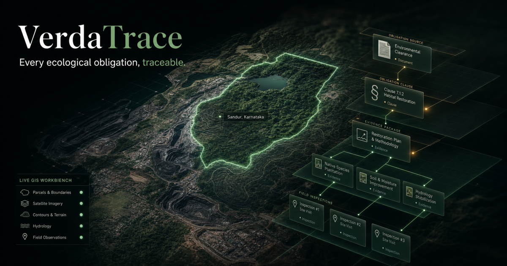
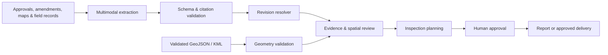

<p align="center">
  
</p>

<h1 align="center">VerdaTrace</h1>

<p align="center">
  An AI-native workspace for turning environmental approvals, amendments, maps, images, and field records into current obligations, evidence gaps, spatial change, and inspection-ready action.
</p>

<p align="center">
  <a href="https://verdatrace.com/"><strong>Explore the live MVP →</strong></a>
</p>

<p align="center">
  
  
  
  
  
</p>

> [!NOTE]
> VerdaTrace is an MVP and a product demonstration. It helps teams organize and review evidence; it does not determine legal compliance, replace environmental experts, or make regulatory decisions.

## Why VerdaTrace

Environmental commitments rarely live in one place. The current obligation may be split between an original approval, later amendments, maps, field imagery, and operational reports. VerdaTrace brings those records into one reviewable workspace so an expert can see what is active, what evidence is missing, where change needs attention, and what should happen next.

## Product surfaces

| Surface | What it helps a reviewer do |
| --- | --- |
| **01 · Case Intelligence** | Extract source-cited obligations, resolve amendments, compare clauses, assess evidence coverage, and prepare inspection actions. |
| **02 · Spatial Evidence** | Review satellite imagery and validated boundary analysis with land-cover evidence, confidence, provenance, and an explicit uncertainty state. |
| **03 · Workflow Orchestrator** | Coordinate document, spatial, inspection, report, and approved-delivery steps through dependency-aware, human-reviewed workflows. |
| **04 · AlphaEarth research preview** | Explore the future research direction for landscape similarity; this preview never presents uncalibrated research as a live result. |

## What the MVP demonstrates

- Clause-level citations and deterministic amendment/supersession relationships
- A visual revision graph, evidence ledger, and human-editable inspection plan
- Real satellite overview and validation-gated spatial analysis for Polygon or MultiPolygon GeoJSON/KML
- Nine-class land-cover results with confidence, coverage, acquisition periods, provenance, and review signals when live spatial computation is configured
- A recorded sample workflow that is clearly labelled as recorded, plus approval checkpoints before workspace changes, report finalization, or external delivery
- Source-aware PDF reports and auditable agent events that distinguish completed work, review requests, and failures

## Product boundaries

VerdaTrace is deliberately designed to make uncertainty visible.

- AI outputs are proposals for expert review, not legal or compliance conclusions.
- Missing evidence is shown as missing; it is never silently converted into a finding of non-compliance.
- Parcel-level statistics require a validated area boundary. An overview map is not presented as a verified project parcel.
- The bundled workflow is a recorded sample. It never claims to have sent an email, uploaded to Drive, or run research computation when it has not.
- Browser-only case and spatial uploads are processed in memory. Durable workflow uploads require an explicit signed-in workflow and are subject to the runtime's retention controls.

## Architecture



The application pairs model-assisted interpretation with deterministic validation, typed actions, and explicit review gates. The aim is a more traceable decision process—not opaque automation.

## Run locally

**Prerequisite:** Node.js 22.13 or newer.

```bash
npm install
cp .env.example .env.local
npm run dev
```

The bundled recorded demo and interface can be explored without external credentials. Live document analysis, spatial computation, identity, durable workflow execution, and integrations are optional server-side capabilities; configure only the services you need in `.env.local`. Never commit a populated environment file.

Run the acceptance suite:

```bash
npm test
```

## Public demo data

The repository includes a clearly marked, synthetic GeoJSON boundary for the Screen 02 demonstration. It is **not** an official project boundary and must not be used for operational or regulatory decisions. The bundled case narrative refers only to publicly accessible government records listed below.

- [May 2025 final approval](https://forestsclearance.nic.in/writereaddata/RO_Approved/051520251document-18.pdf)
- [September 2025 amendment](https://forestsclearance.nic.in/writereaddata/AdditionalInformation/AddInfoSought/0_0_9114121512121IMOEFCC0000337514_1756881077629%282%29.pdf)
- [Proposal record](https://forestsclearance.nic.in/viewreport_B.aspx?pid=FP%2FKA%2FROAD%2F7440%2F2014)

## Privacy and security

- Keep credentials in local or hosted environment configuration only; the repository contains empty placeholders in [`.env.example`](.env.example).
- Do not use the public demo or its sample data for confidential project material.
- Report a potential vulnerability privately using the contact route at [verdatrace.com/contact](https://verdatrace.com/contact), rather than opening a public issue.

## Source availability

Copyright © 2026 VerdaTrace. All rights reserved.

This repository is public for product evaluation, research transparency, and portfolio review. It does not grant permission to copy, modify, redistribute, sublicense, or commercially use the source or brand assets. See [LICENSE.md](LICENSE.md) for details. Third-party libraries, services, imagery, and data remain governed by their own licenses and terms.
