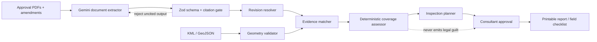

# Architecture and agent controls

## Same-day MVP

- Vinext / Next.js and TypeScript on Cloudflare Workers
- Gemini 3.1 Flash-Lite PDF input and JSON-schema output
- Zod validation and deterministic inspection rules
- D1-backed per-visitor and production-wide Gemini request budgets
- MapLibre with an honest approximate-location fallback
- Bundled public demo data and session-only uploads

## Production roadmap

- Cloud Storage for permissioned evidence
- PostgreSQL / PostGIS for project, revision, and spatial history
- Role-based access and immutable agent-run logs
- Earth Engine with Dynamic World and AlphaEarth-derived signals
- Offline Gemma field assistant

## Control boundary

The AI can extract, link, summarize, and prioritize. It cannot declare legal
compliance, fabricate missing geometry, approve its own findings, or publish
unmeasured impact claims.

The public demo account is pre-populated and anonymous. It receives three live
analyses per visitor per hour, subject to a 30-analysis production-wide hourly
budget. The Gemini key remains server-side and is never returned to the browser.
